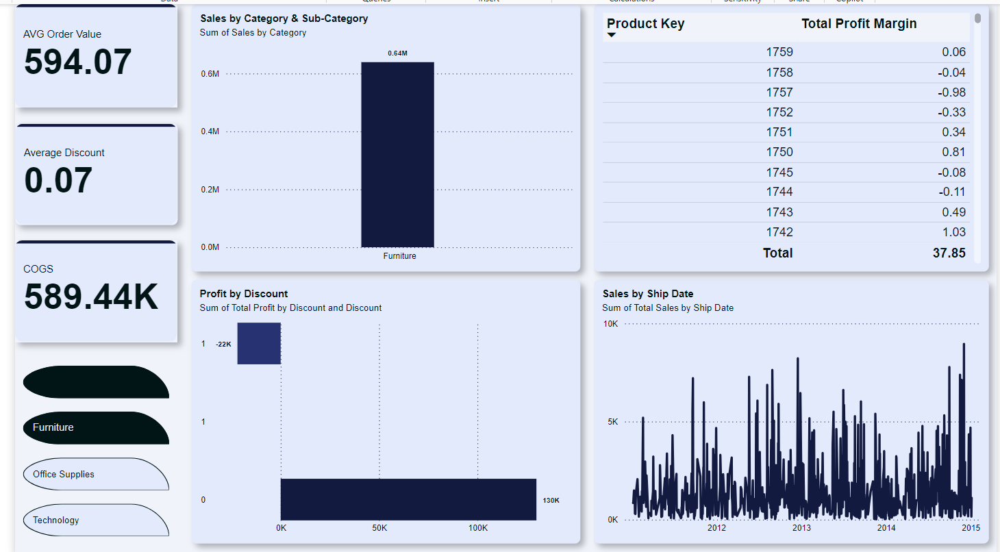
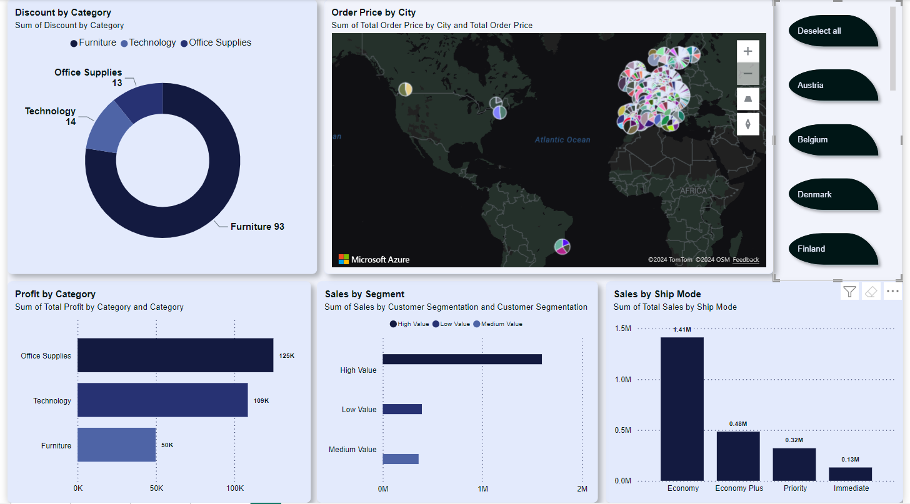
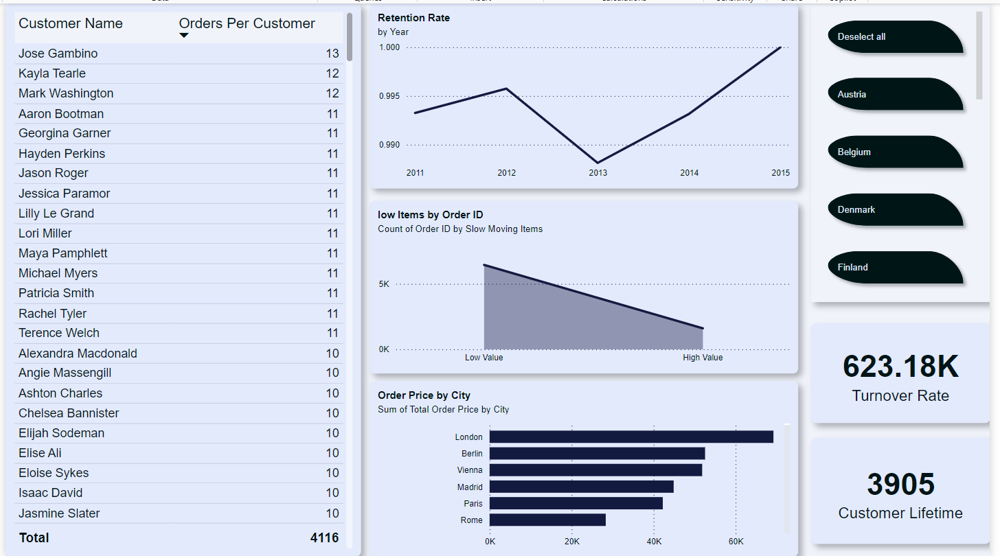

# Power BI Business Analysis Dashboard

This project involves creating a dynamic and interactive Power BI dashboard to analyze business performance. The dashboard provides insights into sales, profitability, customer behavior, and operational efficiency, enabling data-driven decision-making.

---

## Features

- **Data Cleaning & Transformation**: 
  - Preprocessed raw data to ensure accuracy and consistency.
  - Removed null and invalid values for better analysis.
  - Converted data types to maintain accuracy in calculations.
  
- **Interactive Dashboards**:
  - Visualized sales trends, profit margins, shipping performance, and customer segmentation.
  - Included dynamic filtering options such as slicers for date, category, and region.

- **Custom Measures & KPIs**:
  - Created powerful DAX measures and calculations to analyze performance, including:
    - **Total Sales**
    - **Profit Margin**
    - **Customer Lifetime Value (CLV)**
    - **Inventory Turnover Rate**
  
- **User-Friendly Interface**:
  - Developed clear and intuitive dashboards with visually appealing charts, graphs, and tables.
  - Enabled user interactivity through slicers and drill-through functionality.

---

## Dashboard Previews

### 1. Sales Performance:

![Sales Performance]images/1.png)

---

### 2. Customer Analysis:



---

### 3. Product Analysis:



---

### 4. Distribution Analysis:



---

## How to Use

1. **Clone the Repository**:
   Download the repository to your local machine using the following command:
   ```bash
   git clone https://github.com/NOUR12321/Business-Performance-Analysis-Dashboard.git
